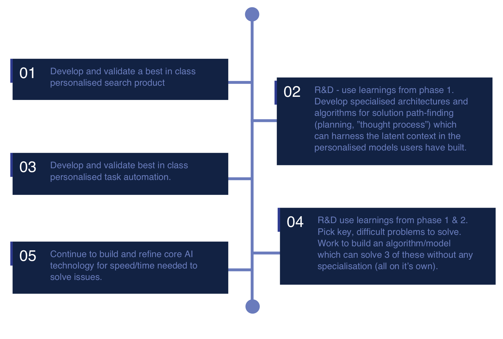

# Welcome to the Searchr Wiki

This wiki for Searchr contains much of the content and resources available publicly.

If you feel like contributing to the wiki, like changing or adding things, feel free to create an [Issue](https://github.com/shaunnarayan/searchr-wiki/issues) or submit a [Pull Request](https://github.com/shaunnarayan/searchr-wiki/pulls) at [https://github.com/shaunnarayan/searchr-wiki](https://github.com/shaunnarayan/searchr-wiki).

For our website visit [preview.searchr.io](http://preview.searchr.io).

## What does the wiki contain?

You can use the menu to the left to navigate the wiki. Here is a brief summary of the contents:

* Documentation

    * Documents and papers related to the project
    * Developer resources
    * Information about the Searchr multisig structure and wallets

* Development

    * Technical descriptions and documentation for Searchr

* Design

    * Visual assets for Searchr
    * App UI, brand guidelines, logos, merchandise, and more

* Meetings

    * Information and agendas for our public meetings

* Jobs

    * Details about our culture, work conditions and guide for applying to work at Searchr
    * Our current job openings

* Blog posts

    * Index and links to all of our blog posts

* Videos

    * Links to all our videos

* Press

    * Searchr Press Kit for Press/Media
    * Contact information for media/press inquiries

* Archive

    * Old, deprecated documents and files that are kept for archiving purposes only

* Translations

    * Translations of documents into non-English languages

## What is Searchr?

<h4 style="color:#00CBE6;">SEARCH SMARTER</h4>
**Scour the internet using videos, images, audio or web content to start, then let our one-click feedback AI keep searching until it finds what you’re looking for**

> ...

### Why Searchr?

<h4 style="color:#00CBE6;">OUR VISION</h4>
**Evolution of the internet and blockchain technology are changing the ways we interact with each other**

...

## Community channels

Searchr Chat - [https://chat.searchr.io](https://chat.searchr.io)

Reddit - [https://www.reddit.com/r/searchr_io/](https://www.reddit.com/r/searchr_io/)

Twitter - [https://twitter.com/searchr_io](https://twitter.com/searchr_io)

LinkedIn - [https://www.linkedin.com/company/searchr_io/](https://www.linkedin.com/company/searchr_io/)

YouTube - [https://www.youtube.com/c/searchr_io](https://www.youtube.com/c/searchr_io)

## Team

> 

> * **Development**: [Shaun Narayan](https://twitter.com/CatAddict420)

> 

> * **Deisgn**: [Sarah Narayan](https://twitter.com/cryptosaraah)
